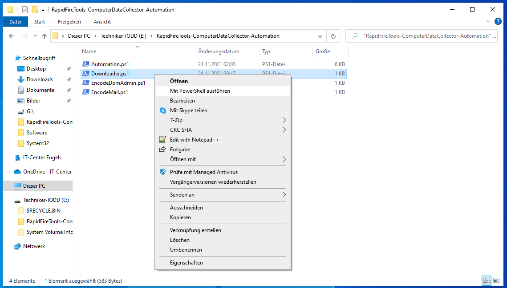
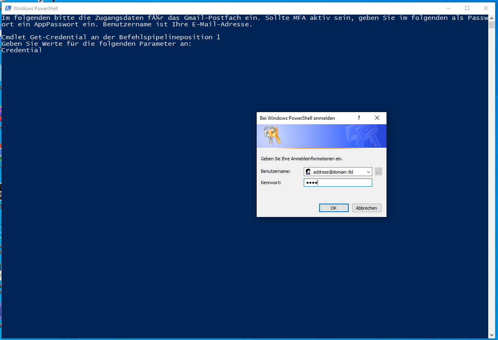

# RapidFireTools-ComputerDataCollector-Automation
Automation for RapidFire Tools Computer Data Collector.

1. Move the Project to a usb stick.

2. Run the "Download.ps1" to download the Computer Data Collector from RapidFire Tools by right clicking and then choosing "Run with PowerShell".

3. After the download is finished the script will unzip it and delete the zip file. All you will be left with, will be the unpacked Computer Data Collector.

4. Run the "EncodeDomAdmin.ps1" script to encrypt the credentials of an admin which will later be used to run the Computer Data Collector. Just state the credentials and hit "OK".

5. Run the "EncodeMail.ps1" script to encrypt the credentials for a gmail mailbox. This will later be used to send the results.

6. Now you should have the credentials in separat files (only passwords will be encrypted). Next create a new text file.

7. Name it "MailRecipient.txt" and write the mail address of the results recipient. Don't forget to save.

8. Finally run "Automatisierung.ps1". The Computer Data Collector will be copied to the local Machine. You will be prompted for the Inventar-ID of the workstation first. Just type it in and press the enter key.

9. Afterwards the Computer Data Collector will be executed.

10. It will be running under the supplied user account (domain administrator).

11. When the Computer Data Collector is done, it will output a CDF file and many others. The CDF file will be renamed to contain the computer name and Inventar-ID. Then the CDF file will be sent off via mail.

Done.
